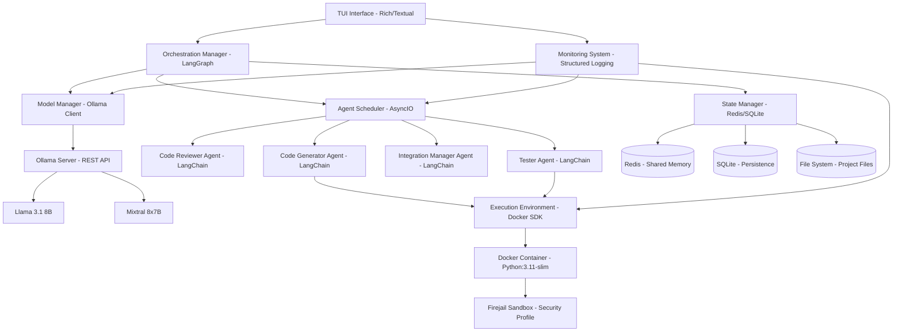
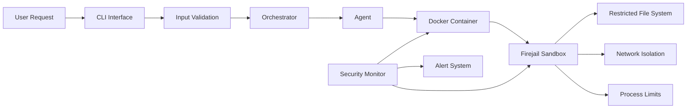

# Design Document

## Overview

Project AURA (Autonomous Unified Research Assistant) is designed as a modular, multi-agent AI coding framework that leverages local LLM infrastructure for secure, autonomous software development. The system employs a microservices architecture with containerized execution environments, enabling specialized AI agents to collaborate on complex coding tasks while maintaining security and observability.

The core architecture follows a hub-and-spoke pattern with a central orchestration layer managing specialized agents, each responsible for specific aspects of the development workflow. The system is designed for continuous operation with built-in resilience, monitoring, and self-improvement capabilities.

## Architecture

### High-Level Architecture



### Core Components Architecture

The system is built around five primary architectural layers:

1. **Interface Layer**: TUI interface using Rich/Textual for real-time interaction and monitoring
2. **Orchestration Layer**: LangGraph-based workflow management with AsyncIO for concurrency
3. **Agent Layer**: LangChain-powered specialized AI agents with structured prompting
4. **Execution Layer**: Docker SDK + Firejail for secure, containerized code execution
5. **Infrastructure Layer**: Ollama REST API, Redis for shared state, SQLite for persistence

### Framework and Technology Stack

**Core Frameworks**:
- **LangGraph**: Workflow orchestration and agent coordination
- **LangChain**: Agent implementation and LLM interaction
- **Rich/Textual**: Advanced TUI with real-time updates and interactive components
- **AsyncIO**: Asynchronous task execution and agent coordination
- **Docker SDK**: Programmatic container management
- **Redis**: High-performance shared memory and inter-agent communication
- **SQLite**: Lightweight persistence for task history and learning data

**Key Libraries**:
- `langgraph>=0.0.40` - Agent workflow orchestration
- `langchain>=0.1.0` - LLM agent framework
- `textual>=0.40.0` - Modern TUI framework
- `rich>=13.0.0` - Rich text and formatting
- `docker>=6.0.0` - Docker container management
- `redis>=4.5.0` - In-memory data structure store
- `ollama-python>=0.1.0` - Ollama API client
- `asyncio` - Asynchronous programming support

### Security Architecture



## Components and Interfaces

### 1. TUI Interface System

**Framework**: Textual + Rich for advanced terminal user interface

**Key Components**:
- **Main Dashboard**: Real-time agent status, task progress, system metrics
- **Task Manager**: Interactive task creation, monitoring, and control
- **Agent Monitor**: Live agent activity, conversation logs, performance metrics
- **System Health**: Resource usage, error logs, security alerts
- **Project Browser**: File tree, code diff viewer, generated artifacts

**Implementation Details**:
```python
from textual.app import App
from textual.widgets import Header, Footer, Static, Tree, Log, ProgressBar
from rich.console import Console
from rich.live import Live
from rich.table import Table

class AURAApp(App):
    CSS_PATH = "aura.css"
    
    def compose(self) -> ComposeResult:
        yield Header()
        yield Container(
            AgentStatusWidget(),
            TaskProgressWidget(), 
            SystemMetricsWidget(),
            LogViewerWidget(),
            id="main-container"
        )
        yield Footer()
    
    async def on_mount(self) -> None:
        self.orchestrator = OrchestrationManager()
        self.start_background_tasks()
```

### 2. Orchestration Manager

**Framework**: LangGraph for complex workflow orchestration

**Purpose**: Central coordination hub that manages agent lifecycle, task distribution, and system state using LangGraph's state machine capabilities.

**Key Responsibilities**:
- Task parsing and decomposition using LangGraph workflows
- Agent selection and assignment with conditional routing
- Workflow orchestration with parallel and sequential execution
- Resource allocation and conflict resolution
- System health monitoring with automatic recovery

**LangGraph Implementation**:
```python
from langgraph.graph import StateGraph, END
from langgraph.prebuilt import ToolExecutor
from typing import TypedDict, Annotated, Sequence
import operator

class AgentState(TypedDict):
    messages: Annotated[Sequence[BaseMessage], operator.add]
    task: Task
    current_agent: str
    results: Dict[str, Any]
    errors: List[str]

class OrchestrationManager:
    def __init__(self):
        self.workflow = self._build_workflow()
        self.agents = self._initialize_agents()
        
    def _build_workflow(self) -> StateGraph:
        workflow = StateGraph(AgentState)
        
        # Add nodes for each agent
        workflow.add_node("code_generator", self.code_generator_node)
        workflow.add_node("code_reviewer", self.code_reviewer_node)
        workflow.add_node("tester", self.tester_node)
        workflow.add_node("integrator", self.integrator_node)
        
        # Define conditional routing
        workflow.add_conditional_edges(
            "code_generator",
            self.should_review,
            {
                "review": "code_reviewer",
                "test": "tester",
                "end": END
            }
        )
        
        workflow.set_entry_point("code_generator")
        return workflow.compile()
    
    async def process_task(self, task: Task) -> TaskResult:
        initial_state = AgentState(
            messages=[],
            task=task,
            current_agent="",
            results={},
            errors=[]
        )
        
        result = await self.workflow.ainvoke(initial_state)
        return self._format_result(result)
```

### 2. Agent System

**Specialized Agents**:

#### Code Generator Agent
- **Purpose**: Generate code based on requirements and context
- **LLM Model**: Mixtral 8x7B for complex generation, Llama 3.1 8B for simple tasks
- **Capabilities**: Multi-language code generation, pattern recognition, context-aware coding

#### Code Reviewer Agent  
- **Purpose**: Review generated code for quality, security, and best practices
- **Capabilities**: Static analysis, security scanning, style checking, performance analysis

#### Tester Agent
- **Purpose**: Create and execute tests for generated code
- **Capabilities**: Unit test generation, integration testing, test execution and reporting

#### Integration Manager Agent
- **Purpose**: Integrate generated code into existing projects
- **Capabilities**: Dependency management, file organization, conflict resolution

**LangChain Agent Implementation**:
```python
from langchain.agents import AgentExecutor, create_openai_functions_agent
from langchain.tools import BaseTool
from langchain_core.prompts import ChatPromptTemplate
from langchain_community.llms import Ollama

class BaseAgent:
    def __init__(self, model_manager: ModelManager, context: AgentContext):
        self.model_manager = model_manager
        self.context = context
        self.llm = Ollama(base_url="http://localhost:11434")
        self.tools = self._initialize_tools()
        self.agent = self._create_agent()
        
    def _create_agent(self) -> AgentExecutor:
        prompt = ChatPromptTemplate.from_messages([
            ("system", self._get_system_prompt()),
            ("human", "{input}"),
            ("placeholder", "{agent_scratchpad}"),
        ])
        
        agent = create_openai_functions_agent(
            self.llm, 
            self.tools, 
            prompt
        )
        
        return AgentExecutor(
            agent=agent,
            tools=self.tools,
            verbose=True,
            max_iterations=10,
            handle_parsing_errors=True
        )
    
    async def process_task(self, task: AgentTask) -> AgentResult:
        try:
            result = await self.agent.ainvoke({
                "input": task.instructions,
                "context": task.context
            })
            return self._format_result(result)
        except Exception as e:
            return self.handle_error(e)

class CodeGeneratorAgent(BaseAgent):
    def _get_system_prompt(self) -> str:
        return """You are a specialized code generation agent. Your role is to:
        1. Generate high-quality, production-ready code
        2. Follow project conventions and coding standards
        3. Include comprehensive documentation and comments
        4. Consider security and performance implications
        5. Ensure code is testable and maintainable
        
        Available tools: {tools}
        Project context: {context}
        """
    
    def _initialize_tools(self) -> List[BaseTool]:
        return [
            FileReadTool(),
            FileWriteTool(),
            DirectoryListTool(),
            CodeAnalysisTool(),
            DependencyCheckTool()
        ]
```

### 3. Model Manager

**Framework**: Ollama Python Client with custom resource management

**Purpose**: Manages LLM model lifecycle, switching, and optimization with detailed resource monitoring.

**Key Features**:
- Dynamic model switching based on task complexity and VRAM availability
- Model performance monitoring with detailed metrics collection
- VRAM usage tracking using nvidia-ml-py3
- Connection pooling and request queuing for Ollama API
- Automatic model preloading and warming

**Detailed Implementation**:
```python
import ollama
import psutil
import nvidia_ml_py3 as nvml
from asyncio import Queue, Semaphore
from dataclasses import dataclass
from typing import Dict, Optional
import time

@dataclass
class ModelConfig:
    name: str
    vram_requirement: int  # MB
    context_length: int
    performance_tier: int  # 1-5, higher is better
    specialization: List[str]  # ["code", "review", "test"]

@dataclass
class ResourceStatus:
    total_vram: int
    used_vram: int
    available_vram: int
    cpu_usage: float
    memory_usage: float
    active_model: Optional[str]
    queue_length: int

class ModelManager:
    def __init__(self):
        self.client = ollama.AsyncClient()
        self.models = self._load_model_configs()
        self.current_model = None
        self.request_queue = Queue(maxsize=100)
        self.semaphore = Semaphore(3)  # Max 3 concurrent requests
        self.performance_history = {}
        nvml.nvmlInit()
        
    def _load_model_configs(self) -> Dict[str, ModelConfig]:
        return {
            "llama3.1:8b": ModelConfig(
                name="llama3.1:8b",
                vram_requirement=8000,
                context_length=8192,
                performance_tier=3,
                specialization=["code", "general"]
            ),
            "mixtral:8x7b": ModelConfig(
                name="mixtral:8x7b", 
                vram_requirement=16000,
                context_length=32768,
                performance_tier=5,
                specialization=["code", "review", "complex"]
            )
        }
    
    async def get_optimal_model(self, task_type: str, complexity: int) -> str:
        resource_status = self.monitor_resources()
        
        # Filter models by VRAM availability
        available_models = [
            model for model in self.models.values()
            if model.vram_requirement <= resource_status.available_vram
        ]
        
        # Filter by specialization
        specialized_models = [
            model for model in available_models
            if task_type in model.specialization
        ]
        
        if not specialized_models:
            specialized_models = available_models
            
        # Select based on complexity and performance tier
        if complexity >= 4 and specialized_models:
            return max(specialized_models, key=lambda m: m.performance_tier).name
        else:
            return min(specialized_models, key=lambda m: m.vram_requirement).name
    
    def monitor_resources(self) -> ResourceStatus:
        # GPU monitoring
        handle = nvml.nvmlDeviceGetHandleByIndex(0)
        gpu_info = nvml.nvmlDeviceGetMemoryInfo(handle)
        
        return ResourceStatus(
            total_vram=gpu_info.total // 1024**2,
            used_vram=gpu_info.used // 1024**2,
            available_vram=(gpu_info.total - gpu_info.used) // 1024**2,
            cpu_usage=psutil.cpu_percent(),
            memory_usage=psutil.virtual_memory().percent,
            active_model=self.current_model,
            queue_length=self.request_queue.qsize()
        )
    
    async def switch_model(self, model_name: str) -> bool:
        try:
            # Check if model is available
            models = await self.client.list()
            available_models = [m['name'] for m in models['models']]
            
            if model_name not in available_models:
                # Pull model if not available
                await self.client.pull(model_name)
            
            # Warm up the model
            await self.client.generate(
                model=model_name,
                prompt="Hello",
                options={"num_predict": 1}
            )
            
            self.current_model = model_name
            return True
            
        except Exception as e:
            print(f"Failed to switch to model {model_name}: {e}")
            return False
    
    async def generate_with_retry(self, model: str, prompt: str, **kwargs) -> str:
        max_retries = 3
        for attempt in range(max_retries):
            try:
                async with self.semaphore:
                    start_time = time.time()
                    
                    response = await self.client.generate(
                        model=model,
                        prompt=prompt,
                        **kwargs
                    )
                    
                    execution_time = time.time() - start_time
                    self._record_performance(model, execution_time, len(prompt))
                    
                    return response['response']
                    
            except Exception as e:
                if attempt == max_retries - 1:
                    raise e
                await asyncio.sleep(2 ** attempt)  # Exponential backoff
    
    def _record_performance(self, model: str, execution_time: float, prompt_length: int):
        if model not in self.performance_history:
            self.performance_history[model] = []
            
        self.performance_history[model].append({
            'timestamp': time.time(),
            'execution_time': execution_time,
            'prompt_length': prompt_length,
            'tokens_per_second': prompt_length / execution_time if execution_time > 0 else 0
        })
        
        # Keep only last 100 records per model
        if len(self.performance_history[model]) > 100:
            self.performance_history[model] = self.performance_history[model][-100:]
```

### 4. Execution Environment

**Framework**: Docker SDK + Firejail with comprehensive security profiles

**Purpose**: Provides secure, isolated execution environment for AI-generated code with multiple security layers and detailed monitoring.

**Security Layers**:
1. **Docker Container**: Process isolation, resource limits, network controls
2. **Firejail Sandbox**: Additional syscall filtering and access controls  
3. **File System Restrictions**: Limited access to project directories only
4. **Network Isolation**: Controlled external access with filtering
5. **Resource Limits**: CPU, memory, and execution time constraints

**Detailed Implementation**:
```python
import docker
import subprocess
import tempfile
import os
import signal
from pathlib import Path
from typing import Dict, Any, Optional
import asyncio
import json

@dataclass
class ContainerConfig:
    image: str = "python:3.11-slim"
    memory_limit: str = "512m"
    cpu_limit: float = 1.0
    network_mode: str = "none"
    working_dir: str = "/workspace"
    timeout: int = 300  # 5 minutes
    allowed_packages: List[str] = None

@dataclass 
class ExecutionResult:
    success: bool
    output: str
    error: str
    execution_time: float
    resource_usage: Dict[str, Any]
    security_violations: List[str]
    exit_code: int

class ExecutionEnvironment:
    def __init__(self):
        self.docker_client = docker.from_env()
        self.active_containers = {}
        self.firejail_profile = self._create_firejail_profile()
        
    def _create_firejail_profile(self) -> str:
        profile_content = """
# AURA Firejail Security Profile
caps.drop all
seccomp
noroot
nogroups
nonewprivs
noexec /tmp
noexec /var/tmp
noexec /dev/shm
private-dev
private-tmp
private-etc passwd,group,hostname,hosts,nsswitch.conf,resolv.conf
disable-mnt
net none
shell none
tracelog
        """
        
        profile_path = "/tmp/aura-security.profile"
        with open(profile_path, 'w') as f:
            f.write(profile_content)
        return profile_path
    
    async def create_secure_container(self, config: ContainerConfig) -> str:
        """Create a Docker container with security hardening"""
        
        # Create temporary directory for code execution
        temp_dir = tempfile.mkdtemp(prefix="aura_exec_")
        
        container = self.docker_client.containers.run(
            image=config.image,
            command="sleep infinity",  # Keep container alive
            detach=True,
            remove=True,
            mem_limit=config.memory_limit,
            cpu_quota=int(config.cpu_limit * 100000),
            cpu_period=100000,
            network_mode=config.network_mode,
            working_dir=config.working_dir,
            volumes={
                temp_dir: {
                    'bind': config.working_dir,
                    'mode': 'rw'
                }
            },
            security_opt=[
                "no-new-privileges:true",
                "seccomp:unconfined"  # We'll use Firejail for syscall filtering
            ],
            cap_drop=["ALL"],
            cap_add=["CHOWN", "SETUID", "SETGID"],  # Minimal required caps
            read_only=True,
            tmpfs={
                '/tmp': 'size=100m,noexec,nosuid,nodev',
                '/var/tmp': 'size=50m,noexec,nosuid,nodev'
            }
        )
        
        container_id = container.id
        self.active_containers[container_id] = {
            'container': container,
            'temp_dir': temp_dir,
            'config': config
        }
        
        return container_id
    
    async def execute_code_secure(self, container_id: str, code: str, language: str) -> ExecutionResult:
        """Execute code with Firejail + Docker security"""
        
        if container_id not in self.active_containers:
            raise ValueError(f"Container {container_id} not found")
            
        container_info = self.active_containers[container_id]
        container = container_info['container']
        temp_dir = container_info['temp_dir']
        
        # Write code to temporary file
        code_file = os.path.join(temp_dir, f"code.{self._get_extension(language)}")
        with open(code_file, 'w') as f:
            f.write(code)
        
        # Prepare execution command based on language
        exec_cmd = self._get_exec_command(language, f"code.{self._get_extension(language)}")
        
        # Execute with Firejail inside Docker
        firejail_cmd = [
            "firejail",
            f"--profile={self.firejail_profile}",
            "--quiet",
            f"--timeout={container_info['config'].timeout}",
            "--rlimit-cpu=60",  # 60 seconds CPU time
            "--rlimit-as=536870912",  # 512MB memory
            "--rlimit-fsize=10485760",  # 10MB file size
        ] + exec_cmd
        
        start_time = time.time()
        security_violations = []
        
        try:
            # Execute inside container with timeout
            exec_result = container.exec_run(
                cmd=firejail_cmd,
                workdir="/workspace",
                user="nobody",
                environment={"PYTHONPATH": "/workspace"},
                demux=True
            )
            
            execution_time = time.time() - start_time
            
            # Parse output
            stdout = exec_result.output[0].decode() if exec_result.output[0] else ""
            stderr = exec_result.output[1].decode() if exec_result.output[1] else ""
            
            # Check for security violations in stderr
            if "Operation not permitted" in stderr:
                security_violations.append("Syscall blocked by Firejail")
            if "Permission denied" in stderr:
                security_violations.append("File access denied")
                
            # Get resource usage
            stats = container.stats(stream=False)
            resource_usage = {
                'memory_usage': stats['memory_stats'].get('usage', 0),
                'cpu_usage': stats['cpu_stats'].get('cpu_usage', {}).get('total_usage', 0),
                'execution_time': execution_time
            }
            
            return ExecutionResult(
                success=exec_result.exit_code == 0,
                output=stdout,
                error=stderr,
                execution_time=execution_time,
                resource_usage=resource_usage,
                security_violations=security_violations,
                exit_code=exec_result.exit_code
            )
            
        except docker.errors.APIError as e:
            return ExecutionResult(
                success=False,
                output="",
                error=f"Docker execution error: {str(e)}",
                execution_time=time.time() - start_time,
                resource_usage={},
                security_violations=["Docker API error"],
                exit_code=-1
            )
        
        except Exception as e:
            return ExecutionResult(
                success=False,
                output="",
                error=f"Execution error: {str(e)}",
                execution_time=time.time() - start_time,
                resource_usage={},
                security_violations=["Unknown execution error"],
                exit_code=-1
            )
    
    def _get_extension(self, language: str) -> str:
        extensions = {
            'python': 'py',
            'javascript': 'js',
            'typescript': 'ts',
            'java': 'java',
            'cpp': 'cpp',
            'c': 'c'
        }
        return extensions.get(language.lower(), 'txt')
    
    def _get_exec_command(self, language: str, filename: str) -> List[str]:
        commands = {
            'python': ['python3', filename],
            'javascript': ['node', filename],
            'typescript': ['npx', 'ts-node', filename],
            'java': ['javac', filename, '&&', 'java', filename.replace('.java', '')],
            'cpp': ['g++', filename, '-o', 'output', '&&', './output'],
            'c': ['gcc', filename, '-o', 'output', '&&', './output']
        }
        return commands.get(language.lower(), ['cat', filename])
    
    async def cleanup_container(self, container_id: str):
        """Clean up container and temporary files"""
        if container_id in self.active_containers:
            container_info = self.active_containers[container_id]
            
            # Stop and remove container
            try:
                container_info['container'].stop(timeout=5)
                container_info['container'].remove()
            except:
                pass
            
            # Clean up temporary directory
            import shutil
            try:
                shutil.rmtree(container_info['temp_dir'])
            except:
                pass
                
            del self.active_containers[container_id]
    
    async def monitor_execution(self, container_id: str) -> Dict[str, Any]:
        """Monitor container resource usage and status"""
        if container_id not in self.active_containers:
            return {"status": "not_found"}
            
        container = self.active_containers[container_id]['container']
        
        try:
            stats = container.stats(stream=False)
            return {
                "status": "running",
                "memory_usage": stats['memory_stats'].get('usage', 0),
                "memory_limit": stats['memory_stats'].get('limit', 0),
                "cpu_usage": stats['cpu_stats'].get('cpu_usage', {}).get('total_usage', 0),
                "network_io": stats.get('networks', {}),
                "block_io": stats.get('blkio_stats', {})
            }
        except:
            return {"status": "error"}
```

### 5. State Manager

**Framework**: Redis + SQLite with structured data management

**Purpose**: Manages shared state, memory, and persistence across agents and sessions with high-performance caching and reliable persistence.

**Components**:
- **Redis Shared Memory**: High-speed inter-agent communication and temporary state
- **SQLite Persistence**: Reliable storage for task history, learning data, and configurations
- **File System Manager**: Organized storage for generated code and artifacts
- **Context Cache**: Intelligent caching of project context and agent memory

**Detailed Implementation**:
```python
import redis
import sqlite3
import json
import pickle
import hashlib
from typing import Any, Dict, List, Optional
from datetime import datetime, timedelta
import aiofiles
import asyncio
from pathlib import Path

class StateManager:
    def __init__(self, redis_url: str = "redis://localhost:6379", db_path: str = "aura.db"):
        self.redis_client = redis.Redis.from_url(redis_url, decode_responses=True)
        self.db_path = db_path
        self.init_database()
        self.context_cache = {}
        
    def init_database(self):
        """Initialize SQLite database with required tables"""
        conn = sqlite3.connect(self.db_path)
        cursor = conn.cursor()
        
        # Tasks table
        cursor.execute("""
            CREATE TABLE IF NOT EXISTS tasks (
                id TEXT PRIMARY KEY,
                description TEXT NOT NULL,
                type TEXT NOT NULL,
                status TEXT NOT NULL,
                priority INTEGER DEFAULT 0,
                project_id TEXT,
                agent_assignments TEXT,  -- JSON array
                created_at TIMESTAMP DEFAULT CURRENT_TIMESTAMP,
                started_at TIMESTAMP,
                completed_at TIMESTAMP,
                result_data TEXT,  -- JSON
                error_data TEXT,   -- JSON
                execution_time REAL,
                quality_score REAL
            )
        """)
        
        # Agent performance table
        cursor.execute("""
            CREATE TABLE IF NOT EXISTS agent_performance (
                id INTEGER PRIMARY KEY AUTOINCREMENT,
                agent_id TEXT NOT NULL,
                agent_type TEXT NOT NULL,
                task_id TEXT NOT NULL,
                model_used TEXT,
                execution_time REAL,
                quality_score REAL,
                success BOOLEAN,
                error_type TEXT,
                resource_usage TEXT,  -- JSON
                timestamp TIMESTAMP DEFAULT CURRENT_TIMESTAMP,
                FOREIGN KEY (task_id) REFERENCES tasks (id)
            )
        """)
        
        # Project context table
        cursor.execute("""
            CREATE TABLE IF NOT EXISTS project_context (
                project_id TEXT PRIMARY KEY,
                root_path TEXT NOT NULL,
                language TEXT,
                framework TEXT,
                dependencies TEXT,  -- JSON
                coding_style TEXT,  -- JSON
                patterns TEXT,      -- JSON
                last_updated TIMESTAMP DEFAULT CURRENT_TIMESTAMP
            )
        """)
        
        # Learning data table
        cursor.execute("""
            CREATE TABLE IF NOT EXISTS learning_data (
                id INTEGER PRIMARY KEY AUTOINCREMENT,
                context_hash TEXT NOT NULL,
                prompt_template TEXT,
                success_rate REAL,
                avg_quality_score REAL,
                usage_count INTEGER DEFAULT 1,
                last_used TIMESTAMP DEFAULT CURRENT_TIMESTAMP,
                improvements TEXT  -- JSON
            )
        """)
        
        conn.commit()
        conn.close()
    
    # Redis operations for shared state
    async def store_shared_state(self, key: str, value: Any, ttl: int = 3600) -> None:
        """Store data in Redis with optional TTL"""
        try:
            if isinstance(value, (dict, list)):
                serialized_value = json.dumps(value)
            else:
                serialized_value = pickle.dumps(value)
                key = f"pickle:{key}"
            
            self.redis_client.setex(key, ttl, serialized_value)
        except Exception as e:
            print(f"Error storing shared state {key}: {e}")
    
    async def get_shared_state(self, key: str) -> Any:
        """Retrieve data from Redis"""
        try:
            value = self.redis_client.get(key)
            if value is None:
                return None
                
            if key.startswith("pickle:"):
                return pickle.loads(value)
            else:
                return json.loads(value)
        except Exception as e:
            print(f"Error retrieving shared state {key}: {e}")
            return None
    
    async def store_agent_memory(self, agent_id: str, memory: Dict[str, Any]) -> None:
        """Store agent-specific memory with structured keys"""
        memory_key = f"agent_memory:{agent_id}"
        await self.store_shared_state(memory_key, memory, ttl=7200)  # 2 hours
    
    async def get_agent_memory(self, agent_id: str) -> Dict[str, Any]:
        """Retrieve agent-specific memory"""
        memory_key = f"agent_memory:{agent_id}"
        memory = await self.get_shared_state(memory_key)
        return memory if memory else {}
    
    async def store_task_progress(self, task_id: str, progress: Dict[str, Any]) -> None:
        """Store real-time task progress for TUI updates"""
        progress_key = f"task_progress:{task_id}"
        await self.store_shared_state(progress_key, progress, ttl=1800)  # 30 minutes
    
    # SQLite operations for persistence
    async def persist_task_result(self, task: Task, result: TaskResult) -> None:
        """Persist completed task results to SQLite"""
        conn = sqlite3.connect(self.db_path)
        cursor = conn.cursor()
        
        try:
            cursor.execute("""
                INSERT OR REPLACE INTO tasks 
                (id, description, type, status, priority, project_id, agent_assignments,
                 created_at, started_at, completed_at, result_data, error_data, 
                 execution_time, quality_score)
                VALUES (?, ?, ?, ?, ?, ?, ?, ?, ?, ?, ?, ?, ?, ?)
            """, (
                task.id,
                task.description,
                task.type.value,
                result.status.value,
                task.priority,
                task.context.project_id if task.context else None,
                json.dumps([agent.id for agent in result.agents_used]),
                task.created_at.isoformat(),
                result.started_at.isoformat() if result.started_at else None,
                result.completed_at.isoformat() if result.completed_at else None,
                json.dumps(result.output) if result.output else None,
                json.dumps([str(e) for e in result.errors]) if result.errors else None,
                result.execution_time,
                result.quality_score
            ))
            
            conn.commit()
        except Exception as e:
            print(f"Error persisting task result: {e}")
        finally:
            conn.close()
    
    async def record_agent_performance(self, agent_id: str, agent_type: str, 
                                     task_id: str, performance_data: Dict[str, Any]) -> None:
        """Record agent performance metrics"""
        conn = sqlite3.connect(self.db_path)
        cursor = conn.cursor()
        
        try:
            cursor.execute("""
                INSERT INTO agent_performance 
                (agent_id, agent_type, task_id, model_used, execution_time, 
                 quality_score, success, error_type, resource_usage)
                VALUES (?, ?, ?, ?, ?, ?, ?, ?, ?)
            """, (
                agent_id,
                agent_type,
                task_id,
                performance_data.get('model_used'),
                performance_data.get('execution_time'),
                performance_data.get('quality_score'),
                performance_data.get('success', False),
                performance_data.get('error_type'),
                json.dumps(performance_data.get('resource_usage', {}))
            ))
            
            conn.commit()
        except Exception as e:
            print(f"Error recording agent performance: {e}")
        finally:
            conn.close()
    
    async def get_project_context(self, project_id: str) -> Optional[ProjectContext]:
        """Retrieve project context with caching"""
        # Check cache first
        if project_id in self.context_cache:
            cache_entry = self.context_cache[project_id]
            if datetime.now() - cache_entry['timestamp'] < timedelta(minutes=30):
                return cache_entry['context']
        
        # Query database
        conn = sqlite3.connect(self.db_path)
        cursor = conn.cursor()
        
        try:
            cursor.execute("""
                SELECT root_path, language, framework, dependencies, 
                       coding_style, patterns, last_updated
                FROM project_context WHERE project_id = ?
            """, (project_id,))
            
            row = cursor.fetchone()
            if row:
                context = ProjectContext(
                    project_id=project_id,
                    root_path=row[0],
                    language=row[1],
                    framework=row[2],
                    dependencies=json.loads(row[3]) if row[3] else [],
                    coding_style=json.loads(row[4]) if row[4] else {},
                    patterns=json.loads(row[5]) if row[5] else []
                )
                
                # Update cache
                self.context_cache[project_id] = {
                    'context': context,
                    'timestamp': datetime.now()
                }
                
                return context
        except Exception as e:
            print(f"Error retrieving project context: {e}")
        finally:
            conn.close()
            
        return None
    
    async def update_project_context(self, context: ProjectContext) -> None:
        """Update project context in database and cache"""
        conn = sqlite3.connect(self.db_path)
        cursor = conn.cursor()
        
        try:
            cursor.execute("""
                INSERT OR REPLACE INTO project_context 
                (project_id, root_path, language, framework, dependencies, 
                 coding_style, patterns, last_updated)
                VALUES (?, ?, ?, ?, ?, ?, ?, ?)
            """, (
                context.project_id,
                context.root_path,
                context.language,
                context.framework,
                json.dumps(context.dependencies),
                json.dumps(context.coding_style.__dict__ if context.coding_style else {}),
                json.dumps([p.__dict__ for p in context.patterns]),
                datetime.now().isoformat()
            ))
            
            conn.commit()
            
            # Update cache
            self.context_cache[context.project_id] = {
                'context': context,
                'timestamp': datetime.now()
            }
            
        except Exception as e:
            print(f"Error updating project context: {e}")
        finally:
            conn.close()
    
    async def get_performance_analytics(self, days: int = 7) -> Dict[str, Any]:
        """Get performance analytics for the TUI dashboard"""
        conn = sqlite3.connect(self.db_path)
        cursor = conn.cursor()
        
        try:
            # Get task completion rates
            cursor.execute("""
                SELECT status, COUNT(*) as count
                FROM tasks 
                WHERE created_at > datetime('now', '-{} days')
                GROUP BY status
            """.format(days))
            
            task_stats = dict(cursor.fetchall())
            
            # Get agent performance
            cursor.execute("""
                SELECT agent_type, AVG(execution_time) as avg_time, 
                       AVG(quality_score) as avg_quality, 
                       SUM(CASE WHEN success THEN 1 ELSE 0 END) * 100.0 / COUNT(*) as success_rate
                FROM agent_performance 
                WHERE timestamp > datetime('now', '-{} days')
                GROUP BY agent_type
            """.format(days))
            
            agent_stats = {}
            for row in cursor.fetchall():
                agent_stats[row[0]] = {
                    'avg_execution_time': row[1],
                    'avg_quality_score': row[2],
                    'success_rate': row[3]
                }
            
            return {
                'task_statistics': task_stats,
                'agent_performance': agent_stats,
                'period_days': days
            }
            
        except Exception as e:
            print(f"Error getting performance analytics: {e}")
            return {}
        finally:
            conn.close()
    
    async def cleanup_old_data(self, days: int = 30) -> None:
        """Clean up old data from Redis and SQLite"""
        # Clean up old Redis keys
        pattern = "task_progress:*"
        keys = self.redis_client.keys(pattern)
        if keys:
            self.redis_client.delete(*keys)
        
        # Clean up old SQLite data
        conn = sqlite3.connect(self.db_path)
        cursor = conn.cursor()
        
        try:
            cursor.execute("""
                DELETE FROM agent_performance 
                WHERE timestamp < datetime('now', '-{} days')
            """.format(days))
            
            cursor.execute("""
                DELETE FROM tasks 
                WHERE created_at < datetime('now', '-{} days')
                AND status IN ('completed', 'failed')
            """.format(days))
            
            conn.commit()
        except Exception as e:
            print(f"Error cleaning up old data: {e}")
        finally:
            conn.close()
```

## Data Models

### Core Data Structures

```python
@dataclass
class Task:
    id: str
    description: str
    type: TaskType
    priority: int
    context: ProjectContext
    requirements: List[str]
    created_at: datetime
    deadline: Optional[datetime]

@dataclass
class AgentTask:
    id: str
    parent_task_id: str
    agent_type: AgentType
    instructions: str
    context: AgentContext
    dependencies: List[str]

@dataclass
class TaskResult:
    task_id: str
    status: TaskStatus
    output: Any
    artifacts: List[Artifact]
    execution_time: float
    quality_score: float
    errors: List[Error]

@dataclass
class ProjectContext:
    project_id: str
    root_path: str
    language: str
    framework: Optional[str]
    dependencies: List[str]
    coding_style: CodingStyle
    patterns: List[Pattern]

@dataclass
class AgentContext:
    agent_id: str
    capabilities: List[str]
    model: str
    memory: Dict[str, Any]
    performance_metrics: PerformanceMetrics
```

### Database Schema

**Tasks Table**:
```sql
CREATE TABLE tasks (
    id TEXT PRIMARY KEY,
    description TEXT NOT NULL,
    type TEXT NOT NULL,
    status TEXT NOT NULL,
    priority INTEGER DEFAULT 0,
    project_id TEXT,
    created_at TIMESTAMP DEFAULT CURRENT_TIMESTAMP,
    completed_at TIMESTAMP,
    result_data JSON
);
```

**Agent Performance Table**:
```sql
CREATE TABLE agent_performance (
    id INTEGER PRIMARY KEY AUTOINCREMENT,
    agent_id TEXT NOT NULL,
    task_id TEXT NOT NULL,
    execution_time REAL,
    quality_score REAL,
    success BOOLEAN,
    timestamp TIMESTAMP DEFAULT CURRENT_TIMESTAMP
);
```

## Error Handling

### Error Classification

1. **System Errors**: Infrastructure failures, resource exhaustion
2. **Agent Errors**: LLM failures, timeout errors, invalid responses
3. **Execution Errors**: Code compilation/runtime errors, security violations
4. **Integration Errors**: File system conflicts, dependency issues

### Error Recovery Strategies

```python
class ErrorHandler:
    def handle_system_error(self, error: SystemError) -> RecoveryAction:
        if error.type == "resource_exhaustion":
            return self.scale_down_operations()
        elif error.type == "service_unavailable":
            return self.restart_service(error.service)
        
    def handle_agent_error(self, error: AgentError) -> RecoveryAction:
        if error.type == "timeout":
            return self.retry_with_simpler_model()
        elif error.type == "invalid_response":
            return self.regenerate_with_different_prompt()
            
    def handle_execution_error(self, error: ExecutionError) -> RecoveryAction:
        if error.type == "security_violation":
            return self.terminate_and_alert()
        elif error.type == "compilation_error":
            return self.request_code_fix()
```

### Circuit Breaker Pattern

Implement circuit breakers for external dependencies:
- Ollama API calls
- Docker container creation
- File system operations

## Testing Strategy

### Unit Testing
- **Agent Logic**: Test individual agent decision-making and code generation
- **Orchestration**: Test task distribution and workflow management
- **Security**: Test sandbox restrictions and isolation
- **Model Management**: Test model switching and resource management

### Integration Testing
- **Agent Collaboration**: Test multi-agent workflows end-to-end
- **Security Integration**: Test Docker + Firejail security layers
- **Performance**: Test system behavior under load and extended operation

### Security Testing
- **Penetration Testing**: Attempt to break out of sandboxes
- **Code Injection**: Test resistance to malicious code generation
- **Resource Exhaustion**: Test behavior under resource pressure

### Performance Testing
- **Load Testing**: Multiple concurrent tasks
- **Endurance Testing**: 24+ hour continuous operation
- **Memory Testing**: Long-running memory leak detection

### Test Automation Framework

```python
class AURATestFramework:
    def setup_test_environment(self) -> TestEnvironment
    def create_mock_agents(self) -> List[MockAgent]
    def simulate_long_running_task(self, duration: int) -> TestResult
    def verify_security_isolation(self) -> SecurityTestResult
    def measure_performance_metrics(self) -> PerformanceReport
```

## Performance Considerations

### Resource Management
- **VRAM Optimization**: Dynamic model switching based on available memory
- **CPU Scheduling**: Priority-based task scheduling for optimal resource utilization
- **Memory Management**: Automatic cleanup and garbage collection for long-running processes

### Scalability
- **Horizontal Scaling**: Support for multiple agent instances
- **Load Balancing**: Distribute tasks across available resources
- **Caching**: Intelligent caching of model responses and code patterns

### Monitoring Metrics
- Response time per agent type
- Resource utilization (CPU, Memory, VRAM)
- Task success/failure rates
- Security incident frequency
- System uptime and availability

This design provides a robust foundation for implementing Project AURA with clear separation of concerns, comprehensive error handling, and strong security measures while maintaining the flexibility needed for autonomous operation and continuous improvement.